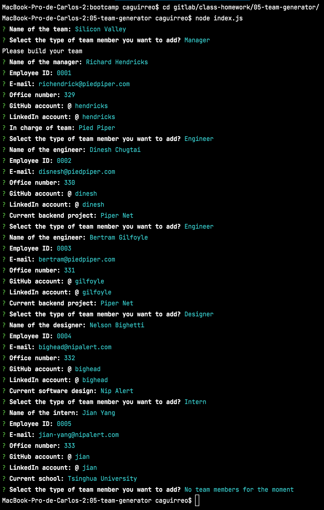
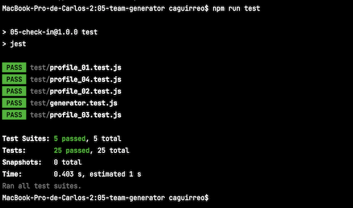

# TEAM-GEN
###### Developed by [*ca2los*](https://github.com/ca2los)
[*HOW IT LOOKS*](https://ca2los.github.io/teamgen/)
VERSION 1.0

### *Team Generator*
The main idea of this project is allow you to *automate the creation of an index.html file* containing
the full data of a web development team. Just in a few steps and without coding a single line, you will
be able to create the file by entering the data from the command line. Everytime you execute the program, 
Team-Gen will create a html file with the data you selected.

### Installation
In order to run *Team-Gen*, you must make sure **Node JS** and **NPM** are already
installed in your computer.

#### *Node JS*
To check if **Node JS** is already installed, from your `Terminal Console` enter the
command `node -v` and press the **ENTER** key. It will show you a message with the
version of Node only if the package was installed before. If the message is different,
[click the link](https://nodejs.org/en/) and download the recommended version of the
package and install it.

#### *NPM*
To check if **NPM** is already installed, from your `Terminal Console` enter the
command `npm -v` and press the **ENTER** key. It will show you a message with the
version of Node only if the package was installed before. If the message is different,
then enter the command `npm install`and press the **ENTER** key.

### How to use it
From your terminal console, go through your files and locate the folder you want
to work with. Now enter the command `npm init -y` and press the **ENTER** key. Now
do the same with the command `npm i inquirer --save` and press the **ENTER** key. 

Once the packages are installed, from your terminal console and in the same folder
run the command `node index.js`and press ENTER. Finally, when the program starts you 
will need to access the requested data and press ENTER every time you finish.

```text
    // Command to initialize the program
    $ node index.js
    
    // Now the program asks you to start filling with data
    ? Name of the team: 
```

#### *WHAT IT DOES?*
1. The `npm init -y` creates a new JSON file loading the main settings of NPM libraries.
2. While `npm i inquirer --save` adds the library **Inquirer** into the JSON generated
   by the previous command.

### SYNTAX

KEY | VALUE
------------ | -------------
`Name of the team:` | Name the team you want to create
`Select the type of team member you want to add?` | Choose between 4 types: Manager, Engineer, Designer, and Intern
`Name of the manager:` | Enter the name of the manager (leader of the team)
`Employee ID` | Enter the employee number, the field only accepts numbers
`E-mail` | Enter the email address
`Office number` | Enter the employee office number, the field only accepts numbers
`GitHub account` | Enter the employee GitHub user, avoid '@'
`LinkedIn account:` | Enter the employee LinkedIn user, avoid '@'
`In charge of team` | Option available only in the Manager's profile
`Current backend project` | Option available only in the Engineer's profile
`Current software design` | Option available only in the Designer's profile
`Current school` | Option available only in the Intern's profile

#### This is how you will see the program running from your CLI:


### Libraries
**[*INQUIRER LINK*](https://www.npmjs.com/package/inquirer)** Library for asking questions, answer validator, and 
parsing input from an array system.

**[*FS LIBRARY LINK*](https://nodejs.org/en/knowledge/file-system/how-to-write-files-in-nodejs/)** Helpful to read, 
write and append a file from the Terminal.

**[*PATH LIBRARY LINK*](https://nodejs.org/api/path.html#path_path_resolve_paths)** Helpful to create and link file paths.

**[*JEST LIBRARY LINK*](https://jestjs.io/docs/getting-started)** This library is obligatory if you want to commit 
changes to the project, and it's useful for testing the code.

### Contributions
Let me know if you are interested in upgrading the base code of the program. [Contact
me via GitHub](https://github.com/ca2los), and commit your changes by following the instructions:

#### Test your code with JEST
Before pushing your changes, you must share a screenshot of the test generated by JEST. To begin with this process: 

1. You must run at you terminal the command `npm install --save-dev jest`. 
2. When the installation has finished, take a look at your `package.json` file and make sure the instruction `"test": "jest"` is inside `scripts`. If not, copy the code and paste it.
3. Now run the command ´npm run test´ and if the program shows you no errors, take a screenshot and add it in your push to make sure the code is OK.

#### Make sure you have something like the image below:


### Testing
The code is still upgrading. New options will be available like choosing between web development, software development,
and design. In the meanwhile, I'll keep you updated.

### MIT License
###### Developed by [*ca2los*](https://github.com/ca2los)